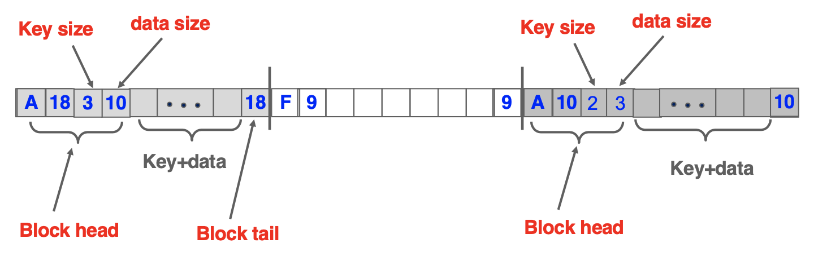

## File System (파일 시스템)

&nbsp;&nbsp;&nbsp;&nbsp;&nbsp;&nbsp;&nbsp;&nbsp;&nbsp;&nbsp;&nbsp;&nbsp;&nbsp;&nbsp;&nbsp;&nbsp;&nbsp;&nbsp;&nbsp;&nbsp;&nbsp;&nbsp;&nbsp;&nbsp;&nbsp;&nbsp;&nbsp;&nbsp;&nbsp;&nbsp;&nbsp;&nbsp;&nbsp;&nbsp;&nbsp;&nbsp;&nbsp;&nbsp;&nbsp;&nbsp;&nbsp;&nbsp;&nbsp;&nbsp;&nbsp;&nbsp;&nbsp;&nbsp;&nbsp;&nbsp;&nbsp;&nbsp;&nbsp;&nbsp;&nbsp;&nbsp;&nbsp;&nbsp;&nbsp;&nbsp;*2018-2 시스템소프트웨어 프로젝트*

**파일 안에 자료구조를 구현 (미니 데이터베이스)**

 

- **구현한 기능 소개**
  - 블록 할당
  - 블록 삭제 및 통합
  - 데이터 검색
  - 데이터 삽입

 

- **사용한 언어 및 도구, 라이브러리**
  + C
  + Unix System Call

 

+ **개발 환경**
  + Ubuntu Linux 16.04
  + Visual Studio Code

 

- **시스템 구성도**

  </img>

---

> 2019.11.15 최종 업데이트
>
> 광운대학교 소프트웨어학부 윤홍찬

